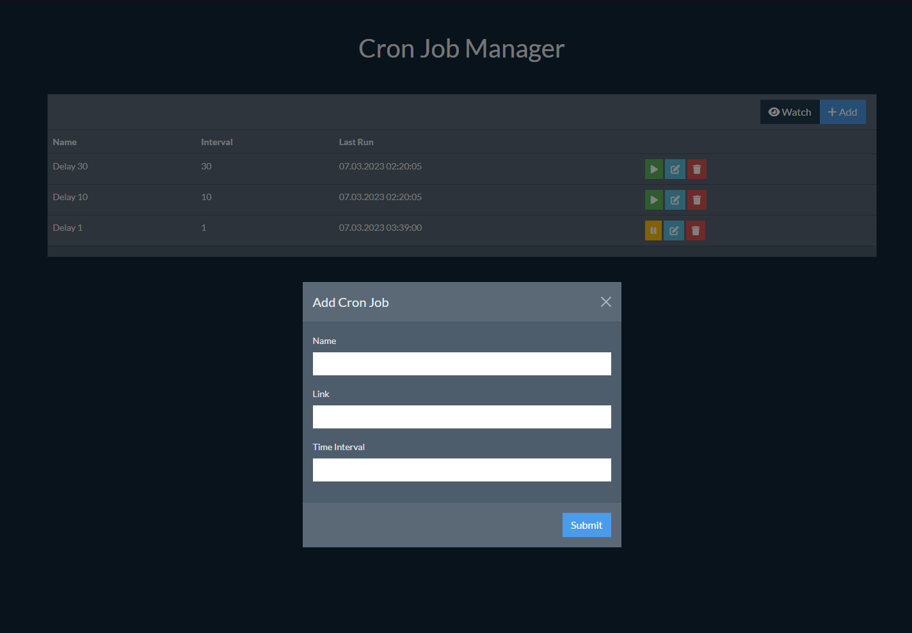

# Cron Manager

NodeJS web panel to manage parallel cron jobs asynchronously

## Installation

1. Rename '.env.example' to '.env'
2. Edit .env file
    1. PORT: port for web panel
    2. SOCKET: port for realtime socket data
    3. SECRET_KEY: a unique encryption key for script
    4. PASSWORD: password for web login
3. Run commands bellow

```sh
npm install
npm i -g pm2
pm2 start process.json
```

### Web Panel: ```http://SERVER-IP:PORT```
example: http://172.16.254.1:3000




## License

The MIT License (MIT). Please see [License File](LISENCE) for more information.