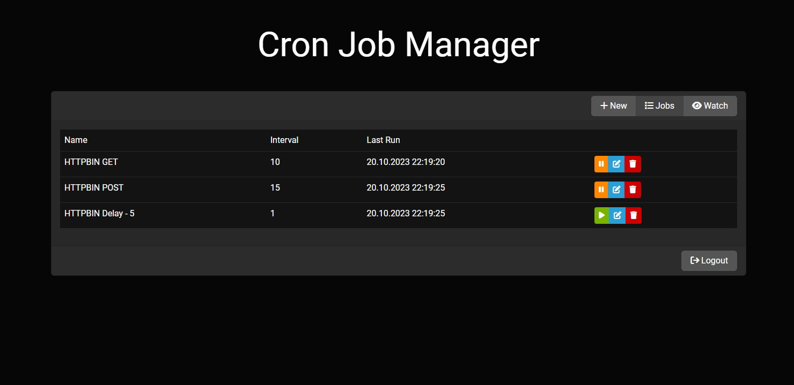
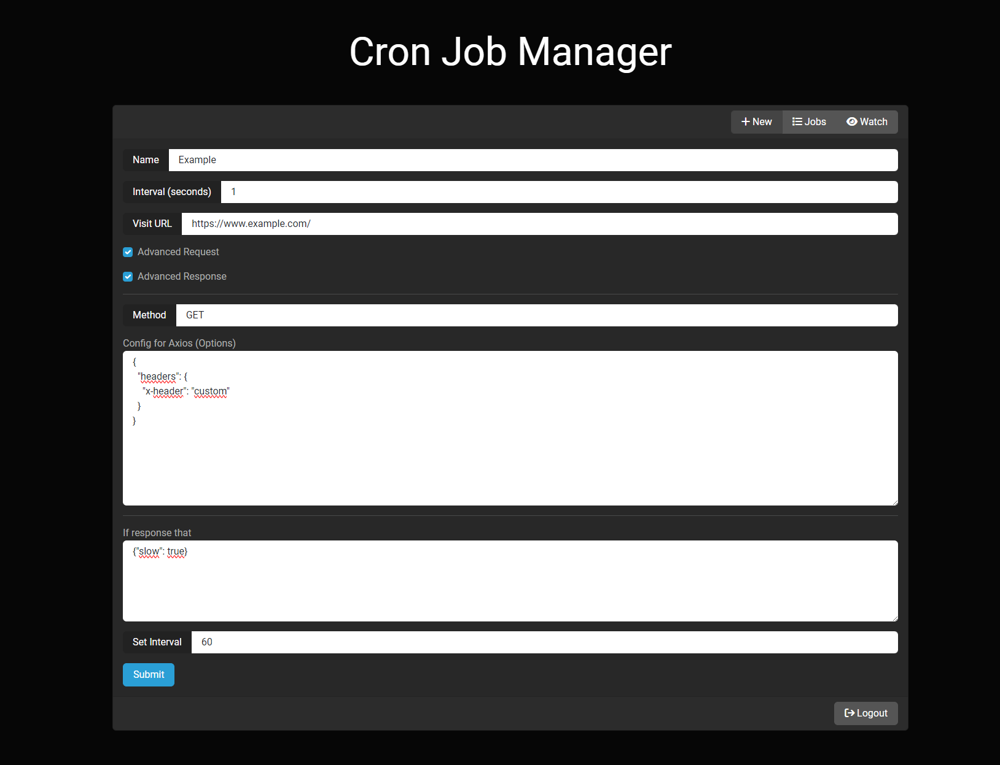

# Cron Manager

NodeJS + React web panel to manage request-based cron jobs in parallel and asynchronously

## Installation

1. Copy '.env.example' and rename it to '.env' in 'server' folder
2. Edit .env file
    1. PORT: port for web panel
    2. SECRET_KEY: a unique encryption key
    3. PASSWORD: admin password for web login
3. Run command below

```sh
npm i -g pm2 && cd client && npm i -D && npm run build && cd .. && cd server && npm i && cd .. && pm2 start process.json
```

### Web Panel: ```http://SERVER-IP:PORT```





## License

The MIT License (MIT). Please see [License File](LISENCE) for more information.