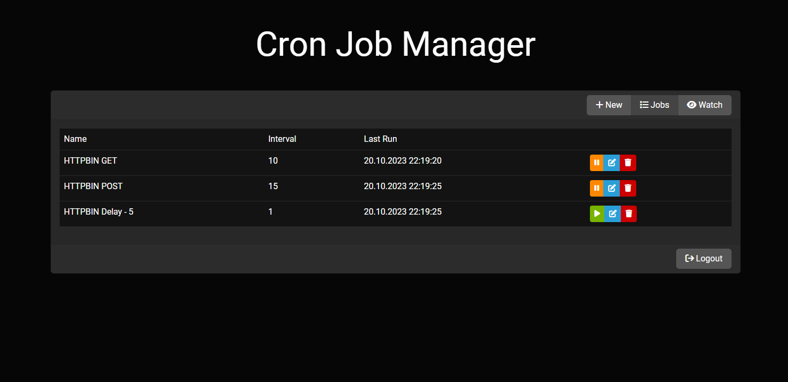
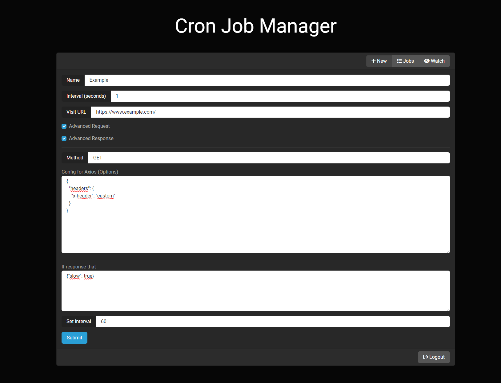
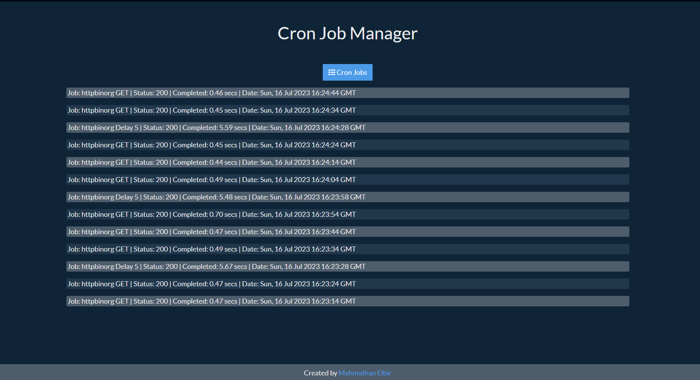

# Cron Manager

<a target="_blank" href="https://hub.docker.com/r/mahelbir/cron-manager"></a>
<a target="_blank" href="https://hub.docker.com/r/mahelbir/cron-manager"></a>

A self-hosted web panel for managing HTTP-based cron jobs with parallel execution and real-time monitoring.

## ⭐ Features

- Parallel and asynchronous HTTP request execution
- Real-time job monitoring via WebSocket
- Configurable interval, concurrency and request options per job
- [Passokey](https://github.com/mahelbir/passokey) authentication support

## 🔧 How to Install

> Panel is accessible at http://localhost:4043 by default

### 🐳 Docker (Recommended)

Download [.env.example](.env.example) as `.env` and configure it, then start with [docker-compose.yaml](docker-compose.yaml):

```
curl -O https://raw.githubusercontent.com/mahelbir/cron-manager/main/docker-compose.yaml
curl -o .env https://raw.githubusercontent.com/mahelbir/cron-manager/main/.env.example
nano .env
```

```
docker compose up -d
```

### 💪🏻 Non-Docker

Requirements:

- [Node.js 20+](https://nodejs.org/)
- [PM2](https://pm2.keymetrics.io/)

```bash
git clone https://github.com/mahelbir/cron-manager.git
cd cron-manager

# Configure environment
cp .env.example server/.env
nano server/.env

# Build and run
cd client && npm ci -D && npm run build && cd ../server && npm ci && npm i pm2 -g  && pm2 start pm2.json
```

## 🔄 How to Update

> Check [.env.example](.env.example) for any new configuration options and update your `.env` accordingly.

### 🐳 Docker

It is recommended to check the latest [docker-compose.yaml](docker-compose.yaml) for any changes before updating.

Pull the latest image and recreate:

```
docker compose pull
docker compose up -d --force-recreate
```

### 💪🏻 Non-Docker

Pull the latest changes and rebuild:

```bash
git pull
cd client && npm ci -D && npm run build && cd ../server && npm ci && pm2 restart pm2.json
```

## 🛠️ Technology Stack

| Technology | Purpose               |
|------------|-----------------------|
| Express    | Backend framework     |
| React      | Frontend UI           |
| SQLite     | Database              |
| Socket.IO  | Real-time  monitoring |
| JWT        | Authentication        |

> For SSO with passkey authentication, you can use [Passokey](https://github.com/mahelbir/passokey).

## 🖼 Screenshots





## 📄 License

The MIT License (MIT). Please see [License File](LICENSE) for more information.
