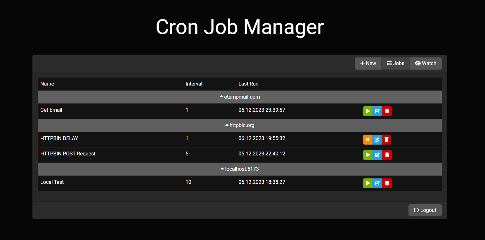

# Cron Manager

A self-hosted web panel built with Node.js and React for managing HTTP-based cron jobs with parallel and asynchronous execution.

## ⭐ Features

- Parallel and asynchronous HTTP request execution
- Real-time job monitoring via WebSocket
- Configurable interval, concurrency and request options per job
- [Passokey](https://github.com/mahelbir/passokey) authentication support

## 🔧 How to Install

### 🐳 Docker (Recommended)

```bash
git clone https://github.com/mahelbir/cron-manager.git
cd cron-manager

# Configure environment
cp data/.env.example data/.env
nano data/.env
```

Then start the container:

```bash
docker compose up -d --build
```

> Cron Manager is now running on http://localhost:4043

### 💪🏻 Non-Docker

Requirements:

- [Node.js 20+](https://nodejs.org/)
- [PM2](https://pm2.keymetrics.io/)

```bash
git clone https://github.com/mahelbir/cron-manager.git
cd cron-manager

# Configure environment
cp data/.env.example server/.env
nano server/.env

# Build and run
cd client && rm -rf node_modules && npm i -D && npm run build && cd ../server && npm i && npm i pm2 -g  && pm2 start process.json
```

## 🛠️ Technology Stack

| Technology        | Purpose                               |
|-------------------|---------------------------------------|
| Node.js           | Server runtime                        |
| Express           | Web framework                         |
| React             | Frontend UI                           |
| SQLite (Sequelize)| Database                              |
| Socket.IO         | Real-time job monitoring              |
| JWT               | Authentication                        |

> For SSO with passkey authentication, you can use [Passokey](https://github.com/mahelbir/passokey).

## 🖼 Screenshots




## 📄 License

The MIT License (MIT). Please see [License File](LICENSE) for more information.
