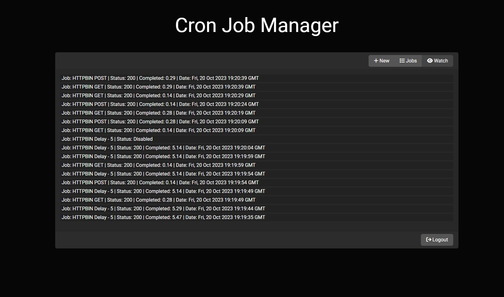

# Cron Manager

Node.js + React web panel to manage request-based cron jobs in parallel and asynchronously

## Installation on Linux

1. Copy '.env.example' and rename it to '.env' in 'server' folder (```cp server/.env.example server/.env```)
2. Edit .env file (```nano server/.env```)
    1. PORT: port for web panel
    2. SECRET_KEY: a unique encryption key
    3. PASSWORD: admin password for web login
3. Build and run

```sh
cd client && rm -rf node_modules && npm i -D && npm run build && cd ../server && npm i && npm i pm2 -g  && pm2 start process.json
```

### Web Panel: ```http://SERVER-IP:PORT```




## License

The MIT License (MIT). Please see [License File](LISENCE) for more information.